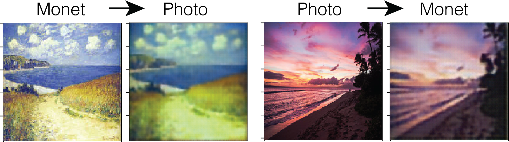

# Fall 2019 CS547 Final Project: CycleGAN Replication and Architecture testing

## Group Members: Tim Murray, Manish Shankla, Chuqiao Shi, Josh Vita


<p align="center">
  
</p>


### Execution instructions:

Our CycleGAN implementation can be run in three ways:

1. Using the Collab notebook found in the link <https://colab.research.google.com/drive/1C4nDeHgmsEA97VqKkQQJnHOQApyQcxzS#scrollTo=nLMLQ-d6Ncd_>
The notebook is also included in the repo as file cyclegan.ipynb. 

2. Using the Makefile command:

```console
#runs the basic CycleGAN model
foo@bar:~$ make all 

#runs the CycleGAN model with an identity loss term
foo@bar:~$ make ident_loss 

#runs the CycleGAN model with an identity loss term and a Wasserstein penelty
foo@bar:~$ make ident_loss_wgan 

```

3. Using a python command

```console
foo@bar:~$ python main.py --datafolder "./datasets" --dataset "monet2photo"\
 --name "tmp" --mode "train" --res 256 --crop_size 256 --num_epochs 600\
 --batch_size 4 --identity_loss 0.5 --lambda_identity_x 10\
  --lambda_identity_y 10 --save_dir "./ckpts/model_base_model_ident_wgan" --wgan_lambda 10
```

Note, all methods require the dataset downloaded to a specific directory. In method 1, the collab notebook, the dataset should be downloaded onto the users google drive. In methods 2 and 3 the dataset should be downloaded into a directory called './dataset' in the top-level directory of the repo. The datasets can be downloaded using the script in the original CycleGAN project github repository:

<https://github.com/junyanz/pytorch-CycleGAN-and-pix2pix/blob/master/datasets/download_cyclegan_dataset.sh>